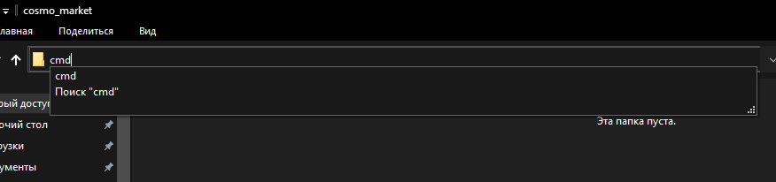
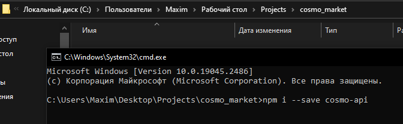

# node-cosmo-api
API Cosmo Game для разработки ботов, приложений, сайтов.

[](https://nodei.co/npm/node-cosmo-api/)
<p>
<a href="https://www.npmjs.com/package/node-cosmo-api"></a>
<a href="https://www.npmjs.com/package/node-cosmo-api"></a>
</p>

# Установка
### Windows:
* Скачайте и установите, желательно, последнюю версию [Node.JS](https://nodejs.org/en/download/)
* Создайте в удобном месте папку, например **cosmo_market**
* Перейдите в командную строку из этой папки: напишите cmd за место пути до папки

* В появившейся консоли пропишите: npm i --save node-cosmo-api


### Ubuntu:
* Установите Node.JS по [этому](https://www.digitalocean.com/community/tutorials/node-js-ubuntu-16-04-ru) гайду
* Создайте в удобном месте папку, например **cosmo_market**
* Перейдите в папку: **cd (путь до вашей папки)**
* Пропишите: npm i --save node-cosmo-api

# Начало работы
Для начала использования, вам нужно создать в своей папке исполняемый файл, пусть это будет **index.js**

Теперь его нужно открыть и импортировать библиотеку:
```js
const COSMOAPI = require('node-cosmo-api');
const cosmo = new COSMOAPI(options);
```

|Опция|Тип|Описание|
|-|-|-|
|options|Object|Опции конструктора|
|options.key|String|Ключ для взаимодействия с API|

### Где взять эти значения
* Получение ключа (key): в настройках бота есть команда **Получить API ключ**

# API

getTransfers - Получает список переводов

```js
const test = async () => {
    const result = await cosmo.methods.getTransfers(type, offset, limit);
    console.log(result);
}
test();
```

|Параметр|Тип|Описание|
|-|-|-|
|type|String|Тип необходимых переводов, доступно: all - любые, in - пополнения, out - переводы|
|offset|Number|Смещение, необходимое для выборки определённого подмножества переводов|
|limit|Number|Количество переводов которое нужно получить, максимальное значение 100|

createTransfer - Делает перевод другому пользователю (сумма в десятичных долях)

```js
const test = () => {
    const result = await cosmo.methods.createTransfer(toId, amount); // 1 коин = 1.00 ед.
    console.log(result);
}
test();
```

|Параметр|Тип|Описание|
|-|-|-|
|toId|Number|Айди получателя|
|amount|Number|Сумма перевода|

getMyBalance - Получает баланс текущего пользователя

```js
const test = async() => {
    const myBalance = await cosmo.methods.getMyBalance();
    console.log(myBalance);
}
test();
```

getBalance - Получает баланс пользователей

```js
const test = async() => {
    const balances = await cosmo.methods.getBalance(ids);
    console.log(balances);
}
test();
```

|Параметр|Тип|Описание|
|-|-|-|
|ids|Number[]|Айди получателей|

# Ссылки
* [Моя ссылка VK](https://vk.com/black_raison_d.etre)